# Real-time Financial Data Surveillance and Alerting System

## 1. Project Overview

This project aims to build a robust and highly performant system for monitoring real-time financial data streams (stocks, cryptocurrencies). It focuses on detecting predefined anomalies (e.g., significant price drops) with low latency, triggering immediate alerts, storing historical data for comprehensive analysis, and providing a flexible API for querying and periodic reports. Leveraging a distributed architecture with multiple workers, the system is designed to handle massive data volumes efficiently and ensure continuous, reliable market surveillance.

## 2. Architecture

The system employs a distributed, event-driven architecture, leveraging microservices for scalability, resilience, and maintainability. It ensures decoupling, asynchronous processing, and real-time capabilities.




## 3. Key Features

*   **Data Simulation**: A Python script (`generator.py`) reads historical data and publishes it to an Apache Kafka topic (`tsla-data`).
*   **Real-time Processing**: A Kafka consumer (`consumer.py`) bridges the data stream to Celery, triggering distributed tasks for analysis.
*   **Anomaly Detection**: A Celery task (`tasks.py`) performs stateful anomaly detection using Redis to maintain a rolling window of prices and calculates Z-scores.
*   **Alerting & Storage**: Upon anomaly detection, alerts are published to a dedicated Kafka topic (`alerts`), and structured anomaly details are indexed into an Elasticsearch index (`alerts`).
*   **API Endpoints**: Provides endpoints for fetching alerts (`/alerts`, `/alerts/{symbol}`) and generating reports (`/v1/reports` for synchronous/asynchronous generation with email delivery, and `/v1/reports/status/{task_id}` for status checks).
*   **Report Generation**: Supports PDF and CSV formats, utilizing a Factory design pattern for extensibility.
*   **Alert System**: Publishes confirmed anomaly alerts to a dedicated Kafka topic (`anomaly_alerts`).

## 4. Technologies Used

*   **Apache Kafka**: Central message bus for real-time data streams and alerts, ensuring high-throughput and fault tolerance.
*   **Redis**: Used as a Celery message broker and for managing sliding windows of recent price data for low-latency calculations.
*   **Celery**: An asynchronous task queue system for distributed anomaly detection processing.
*   **Elasticsearch**: Distributed search and analytics engine for storing, querying, and analyzing detected anomalies.
*   **FastAPI**: High-performance Python web framework for building RESTful APIs, providing interactive documentation and data validation.
*   **Python**: The primary programming language, chosen for its extensive libraries and community support.
*   **Docker**: Used for containerization and orchestration of all core services (Kafka, Zookeeper, Redis, Elasticsearch, Kibana) using Docker Compose, ensuring consistent environments.

## 5. Setup and Running

1.  **Install Prerequisites**: 🐍 Python 3.x, pip, 🐳 Docker (recommended for infrastructure components).
2.  **Install Python Libraries**: `kafka-python`, `celery`, `redis`/`kombu`, `elasticsearch-py`.
3.  **Start Infrastructure**: 🚀 Navigate to the directory containing `docker-compose.yml` and run:
    ```bash
    docker-compose up -d
    ```
    This will start Kafka, Zookeeper, Redis, Elasticsearch, and Kibana.
4.  **Create Kafka Topic**: Use `kafka-topics.sh` to create the `financial_prices` topic.
5.  **Run Data Generator**: 📊
    ```bash
    python generator.py
    ```
6.  **Run Kafka Consumer Bridge**: 🌉
    ```bash
    python consumer.py
    ```
7.  **Run Celery Worker**: ⚙️
    ```bash
    celery -A tasks worker --loglevel=info
    ```

## 6. Current Status

A functional end-to-end pipeline for real-time anomaly detection is implemented, currently working with simulated 1-minute TSLA stock data. The core infrastructure components are managed using Docker Compose. Immediate next steps involve formalizing project structure, implementing proper configuration management, refining data structures, enhancing error handling, and integrating more sophisticated detection algorithms.


