# Project: Real-time Financial Data Surveillance and Alerting

## 1. Project Goal

To build a system that monitors real-time financial data streams (stocks, crypto), detects predefined anomalies (e.g., significant price drops within a short time window), triggers alerts, stores historical data for analysis, and provides an API and periodic reports.

**NOTE:** this the intial plan , and may change during the developpment

[See the current status of the project and what I have done](#21-current-status--implemented-features)

## 2. Architecture Overview 

The system follows a distributed, event-driven architecture using the following core components:

```mermaid
---
title: Hello Title
config:
  flowchart:
    defaultRenderer: "elk"
---
flowchart TB
 subgraph subGraph0["celery and Redis"]
        C2["⚒ Multiple workers"]
        C["⚒ Multiple workers"]
        C1["
           
         Multiple workers"]
        Redis[("Redis Task queue")]
  end
 subgraph subGraph1["Batch Processing & Reporting"]
    direction TB
        F["Celery Beat"]
        G{{"Batch reporting"}}
        H["📆 Daily/Monthly... Reports"]
  end
 subgraph subGraph2["API Access"]
    direction TB
        J["👥 User/Client"]
        I["FastAPI"]
  end
    data_source ==>Kafka_broker
    data_source1 ==>Kafka_broker
    A["data source"] e3@-.-o Kafka_broker["KAFKA"]
    data_source2 ==>Kafka_broker
    Kafka_broker -- produce --> B("Kafka.consumer.: financial_prices")
    B -- Read from Topic --> Redis
    C e8@== Anomaly? ==> D["🔔 Alerting Log/API"]
    D e2@==> alerts["alerts topic"]
    C e5@== Anomalis & Row data ==> E[("Elasticsearch")]
    F -- Schedules --> G
    subGraph1 e7@== 🔎 Queries ==> E
    G -- Generates --> H
    subGraph2 e6@== 🔍 Queries ==> E
    I --> J
    Redis e4@<==> C
    Redis e99@<==> C1
    Redis e98@<==> C2

    C@{ shape: processes}
    C2@{ shape: processes}
    C1@{ shape: processes}
    style subGraph0 color:none
    linkStyle 0 stroke:#FFD600,fill:none
    linkStyle 3 stroke:#D50000
    linkStyle 4 stroke:#D50000,fill:none

    e3@{ animate: true, animation: slow } 
    e8@{ animate: true } 
    e2@{ animate: true } 
    e5@{ animate: true } 
    e7@{ animate: true } 
    e6@{ animate: true } 
    e4@{ animate: true } 
    e99@{ animate: true } 
    e98@{ animate: true } 
```

*   **Data Ingestion:** for now we simulation the real time dataflow using a scirpt , the real time is pushed to kafka topic , the topic is updated in real time with data
*   **Real-time Processing:** A Kafka consumer (see `consumer.py`) reads data from the topic generated by `generator.py`. For each data point, `consumer.py` calls a Celery task. The Celery system places the task in the Redis task queue. Celery workers poll the queue, perform stateful anomaly detection (see section [3.3](#33-real-time-anomaly-detection-python-celery)), trigger alerts, and push data/anomalies to Elasticsearch.
*   **Data Storage:** Elasticsearch stores the raw price data and detected anomalies for querying and analysis.
*   **Batch Processing:** Airflow will schedules  daily tasks to query Elasticsearch and generate summary reports.
*   **API Access:** FastAPI provides endpoints for users/clients to query historical data and anomalies from Elasticsearch.

### 2.1. Current Status & Implemented Features

I have implemented a functional end-to-end pipeline for real-time anomaly detection, currently working with simulated 1-minute TSLA stock data. The key components I've built so far include:

1.   **Data Simulation:** I wrote a Python script (`generator.py`) that reads historical data from a CSV file (`TSLA_1min_sample.csv`) and publishes it message by message to an Apache Kafka topic (`tsla-data`).

2.   **Real-time Processing:** I created a Kafka consumer (`consumer.py`) that bridges this data stream to Celery, triggering distributed tasks for analysis.

3.   **Anomaly Detection:** I developed a Celery task (`tasks.py`) (*with Redis as task queue/msg broker*) that performs stateful anomaly detection. It uses Redis to maintain a rolling window of the last 10 closing prices and calculates the Z-score for the current price, flagging anomalies when the absolute Z-score exceeds 2.5.
4.   **Alerting & Storage:** Upon detecting an anomaly, I implemented two actions:
     1.  **Publishing:** a simple string alert message to a dedicated Kafka topic (`alerts`). I also wrote a basic consumer (`alert_cosumer.py`) to print these alerts for monitoring.
     2.  **Indexing:** a structured document containing details of the anomaly (price, Z-score, mean, std dev, timestamps, etc.) into an Elasticsearch index (`alerts`).
    
5.   **Infrastructure:** I am managing the core infrastructure components (Kafka, Zookeeper, Redis, Elasticsearch, Kibana) using Docker Compose (`docker-compose.yml`).

*Note: Currently, several parameters like server addresses, topic names, and thresholds are hardcoded within the scripts for rapid prototyping and testing purposes.*

This establishes the foundational real-time pipeline. My immediate next steps involve organizing the project structure more formally, implementing proper configuration management (to replace hardcoded values), refining the data structures used for messaging and storage, and enhancing error handling. Following that, I plan to add more sophisticated detection algorithms.

>  *  ⬇⬇   The folowwing part is for more details about the Plan :* 

## 3. Core Components & Technical Plan

### 3.1. Data Simulation (`generator.py`)

*   **Goal:** Simulate a stream of financial price updates.
*   **Implementation:**
    *   Read from sample data (e.g., `TSLA_1min_sample.csv`) or generate synthetic data.
    *   Format data as JSON objects (e.g., `{'symbol': 'TSLA', 'timestamp': '...', 'price': 150.50}`). *Action: Define exact JSON schema based on available data/requirements.*
    *   Connect to Kafka using `kafka-python` producer.
    *   Publish JSON messages to the `financial_prices` Kafka topic.
    *   Include realistic timing delays (e.g., `sleep(60)` for 1-minute data).
    *   *Future Enhancement:* Simulate multiple symbols.

### 3.2. Kafka

*   **Goal:** Act as the central, durable message bus for price data.
*   **Implementation:**
    *   Run Kafka brokers locally (using the downloaded distribution or Docker).
    *   Define topic(s):
        *   `financial_prices`: Main topic for incoming raw price updates. *(Consider partitioning for scalability)*.
        *   *(Optional)* `alerts`: Topic specifically for broadcasting detected anomaly events.
    *   *Action: Decide on final topic strategy and partitioning.*

### 3.3. Real-time Anomaly Detection (Python Celery)

*   **Goal:** Process price updates from Kafka in near real-time, detect anomalies, alert, and store.
*   **Implementation:**
    *   **Celery Setup:**
        *   Use Redis  as the Celery message broker.
        *   Define Celery tasks in Python (e.g., `tasks.py`).
    *   **Kafka Consumer Bridge:** A script/process that:
        *   Consumes messages from the `financial_prices` Kafka topic using `kafka-python`.
        *   For each message, triggers a Celery task (e.g., `process_price_update.delay(message_data)`).
    *   **Celery Task (`process_price_update`):**
        *   Receives price data (JSON dictionary).
        *   **State Management:** Retrieve recent price history for the specific asset (e.g., last 1-5 minutes). *Action: Choose state management strategy (Redis recommended for scalability/resilience) and implement retrieval/update logic.*
        *   **Anomaly Logic:** Implement detection rules (e.g., calculate % change over the time window, compare to threshold like -10%). *Action: Define initial rule(s) and make them configurable if possible.*
        *   **Alerting:** If anomaly detected: Trigger alert mechanism. *Action: Define alert mechanism (e.g., log to file, call webhook, publish to `alerts` Kafka topic).*
        *   **Elasticsearch Indexing:** Push anomaly details and/or raw price data to Elasticsearch. *Action: Define Elasticsearch index structure and data to be stored.*
    *   **Celery Workers:** Run one or more Celery worker processes (`celery -A tasks worker ...`) to execute the tasks.

### 3.4. Data Storage (Elasticsearch)

*   **Goal:** Store historical data and anomalies for querying and analysis.
*   **Implementation:**
    *   Run Elasticsearch locally (e.g., via Docker).
    *   Define index mapping(s): Specify fields and data types (e.g., `timestamp` as date, `price` as float, `symbol` as keyword). Consider time-based indices (e.g., `financial_data-YYYY-MM-DD`).
    *   Celery tasks will use an Elasticsearch Python client (e.g., `elasticsearch-py`) to index data.
    *   *Action: Finalize index mapping and retention policy.*

### 3.5. Batch Reporting (Airflow) - *Future Scope*

*   **Goal:** Generate periodic summary reports (e.g., daily anomaly counts).
*   **Implementation:**
    *   Run Airflow locally (e.g., via Docker).
    *   Define a DAG (Directed Acyclic Graph) scheduled to run daily.
    *   Tasks within the DAG:
        *   Query Elasticsearch for relevant data (e.g., anomalies in the last 24 hours).
        *   Process data and format the report.
        *   Save/send the report. *Action: Define report content, format, and destination.*

### 3.6. API Access (FastAPI) - *Future Scope*

*   **Goal:** Provide an API for querying historical data and anomalies.
*   **Implementation:**
    *   Create a FastAPI Python application.
    *   Define API endpoints (e.g., `/anomalies`, `/prices`).
    *   Endpoints will query Elasticsearch based on request parameters (symbol, time range).
    *   Return results as JSON.
    *   *Action: Define specific API endpoints and query parameters.*

## 4. Setup and Running (Initial Steps)

1.  **Install Prerequisites:** Python 3.x, pip, Docker (recommended for Kafka, Elasticsearch, Redis).
2.  **Install Python Libraries:** `kafka-python`, `celery`, `redis`/`kombu` (for Celery broker), `elasticsearch-py`.
3.  **Start Infrastructure:**
    *   Run Zookeeper & Kafka Broker (using downloaded scripts or Docker).
    *   Run Elasticsearch (Docker recommended).
    *   Run Redis (Docker recommended, if chosen for Celery broker/state).
4.  **Create Kafka Topic:** Use `kafka-topics.sh` to create the `financial_prices` topic.
5.  **Run Generator:** `python generator.py`
6.  **Run Kafka-Celery Bridge:** `python kafka_bridge.py` (Needs to be created)
7.  **Run Celery Worker:** `celery -A tasks worker --loglevel=info` (Requires `tasks.py` with Celery app and task definitions)

## 5. Key Decisions / Actions Needed

*   Finalize JSON data schema for Kafka messages.
*   Choose and implement state management for Celery tasks (Redis recommended).
*   Define specific anomaly detection rule(s) and configurability.
*   Define alerting mechanism.
*   Define Elasticsearch index mapping and data storage strategy (raw vs. anomalies).
*   Define report requirements (content, format).
*   Define API endpoint requirements.
*   Decide on Kafka topic strategy (single vs. multiple).
