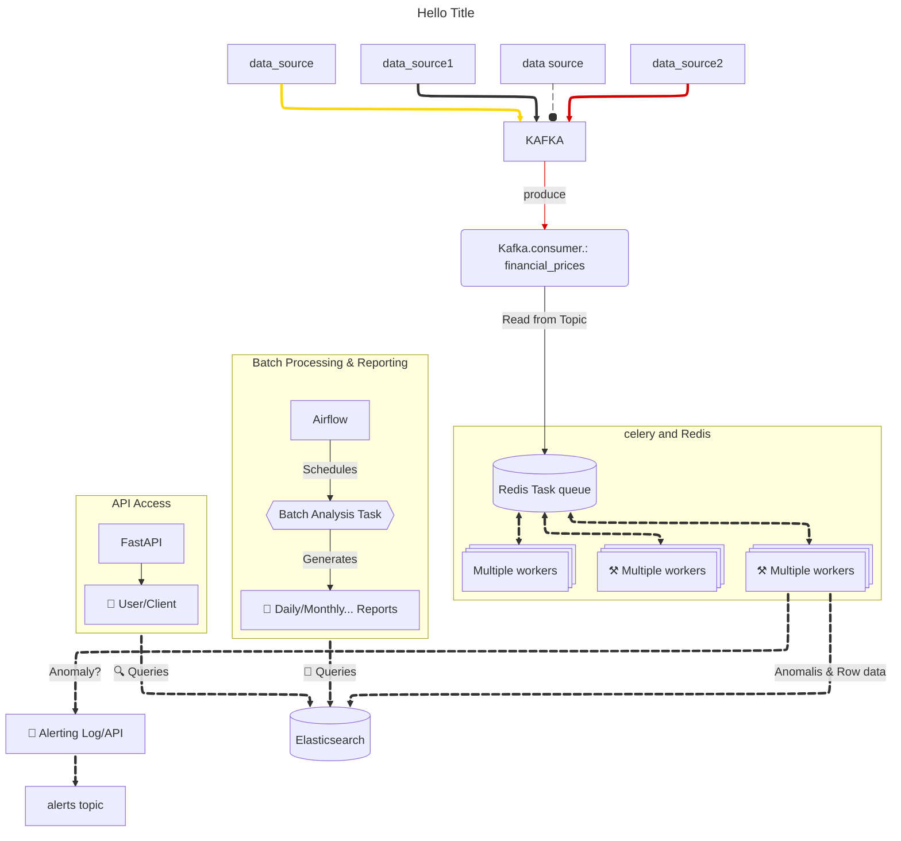

```mermaid
---
title: Hello Title
config:
  flowchart:
    defaultRenderer: "elk"
---
flowchart TB
 subgraph subGraph0["celery and Redis"]
        C2["⚒ Multiple workers"]
        C["⚒ Multiple workers"]
        C1["
           
         Multiple workers"]
        Redis[("Redis Task queue")]
  end
 subgraph subGraph1["Batch Processing & Reporting"]
    direction TB
        F["Airflow"]
        G{{"Batch Analysis Task"}}
        H["📆 Daily/Monthly... Reports"]
  end
 subgraph subGraph2["API Access"]
    direction TB
        J["👥 User/Client"]
        I["FastAPI"]
  end
    data_source ==>Kafka_broker
    data_source1 ==>Kafka_broker
    A["data source"] e3@-.-o Kafka_broker["KAFKA"]
    data_source2 ==>Kafka_broker
    Kafka_broker -- produce --> B("Kafka.consumer.: financial_prices")
    B -- Read from Topic --> Redis
    C e8@== Anomaly? ==> D["🔔 Alerting Log/API"]
    D e2@==> alerts["alerts topic"]
    C e5@== Anomalis & Row data ==> E[("Elasticsearch")]
    F -- Schedules --> G
    subGraph1 e7@== 🔎 Queries ==> E
    G -- Generates --> H
    subGraph2 e6@== 🔍 Queries ==> E
    I --> J
    Redis e4@<==> C
    Redis e99@<==> C1
    Redis e98@<==> C2

    C@{ shape: processes}
    C2@{ shape: processes}
    C1@{ shape: processes}
    style subGraph0 color:none
    linkStyle 0 stroke:#FFD600,fill:none
    linkStyle 3 stroke:#D50000
    linkStyle 4 stroke:#D50000,fill:none

    e3@{ animate: true, animation: slow } 
    e8@{ animate: true } 
    e2@{ animate: true } 
    e5@{ animate: true } 
    e7@{ animate: true } 
    e6@{ animate: true } 
    e4@{ animate: true } 
    e99@{ animate: true } 
    e98@{ animate: true } 
```